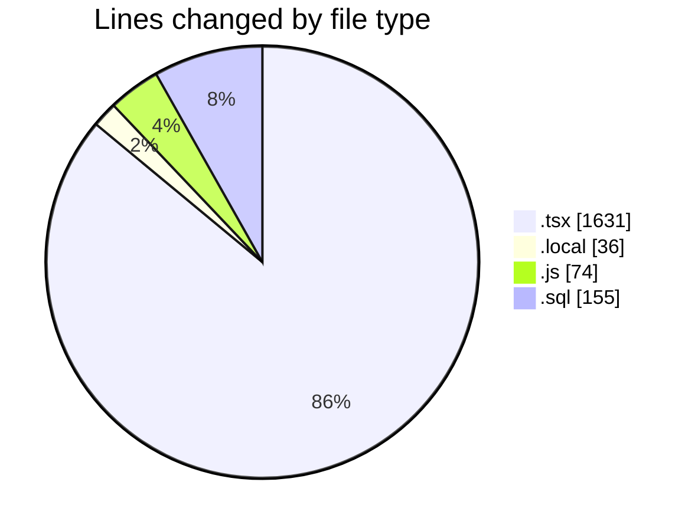
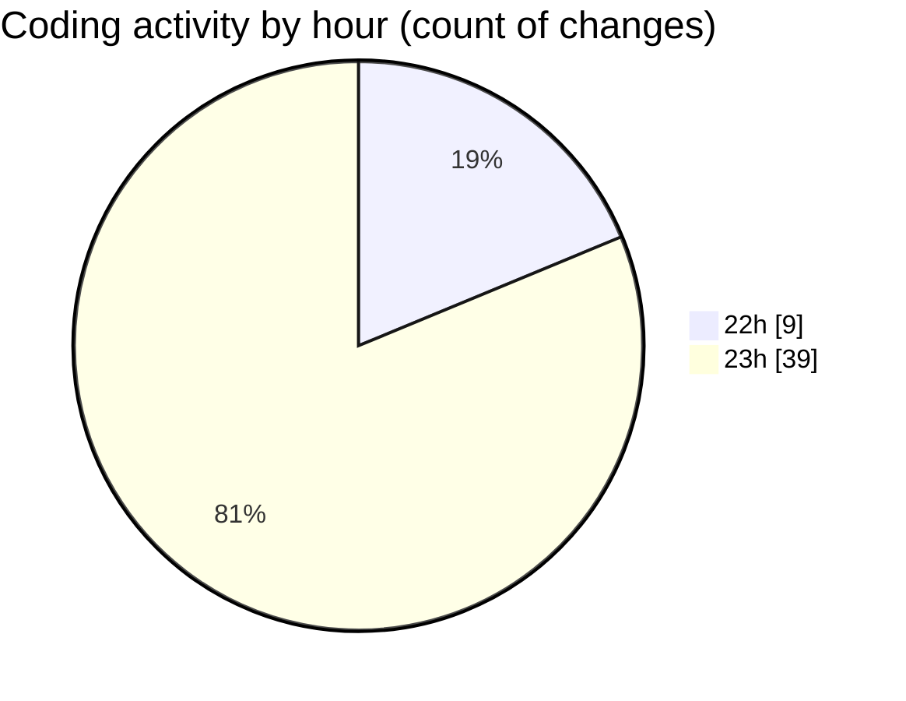

# chatbot-ui-main - Activity Summary 

## Overall Statistics

| Stat                   | Value                                                             |
| ---------------------- | ----------------------------------------------------------------- |
| **Lines Added** (➕)   | 1310                                          |
| **Lines Removed** (➖) | 586                                        |
| **Net Change** (↕)    | 724                |
| **Active Time** (⌚)   | 51 minutes |

## Modified Files
- **layout.tsx** (+485, -473)
- **.env.local** (+36, -0)
- **create-test-user.js** (+74, -0)
- **page.tsx** (+18, -7)
- **20260217021824_add_test_user.sql** (+78, -77)
- **dashboard.tsx** (+134, -0)
- **layout.tsx** (+113, -9)
- **global-state.tsx** (+344, -0)
- **providers.tsx** (+28, -20)

## Visualizations

### By File Type (Lines Changed)

### By Hour (Estimated Activity Count)

> **Last Updated:** 16/02/2026, 23:36:22