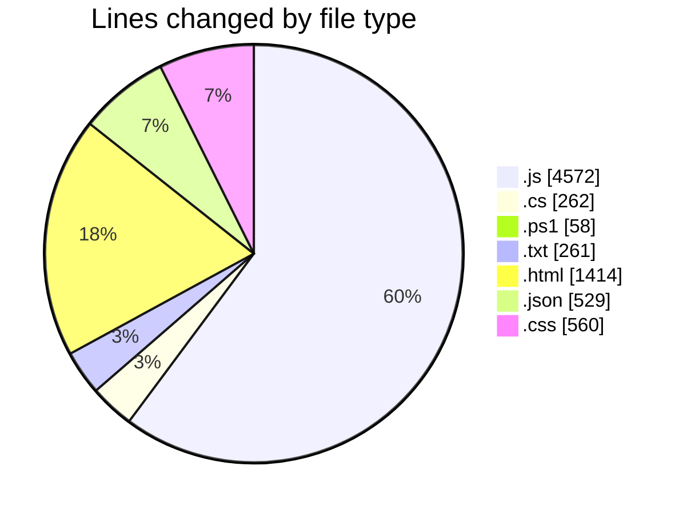
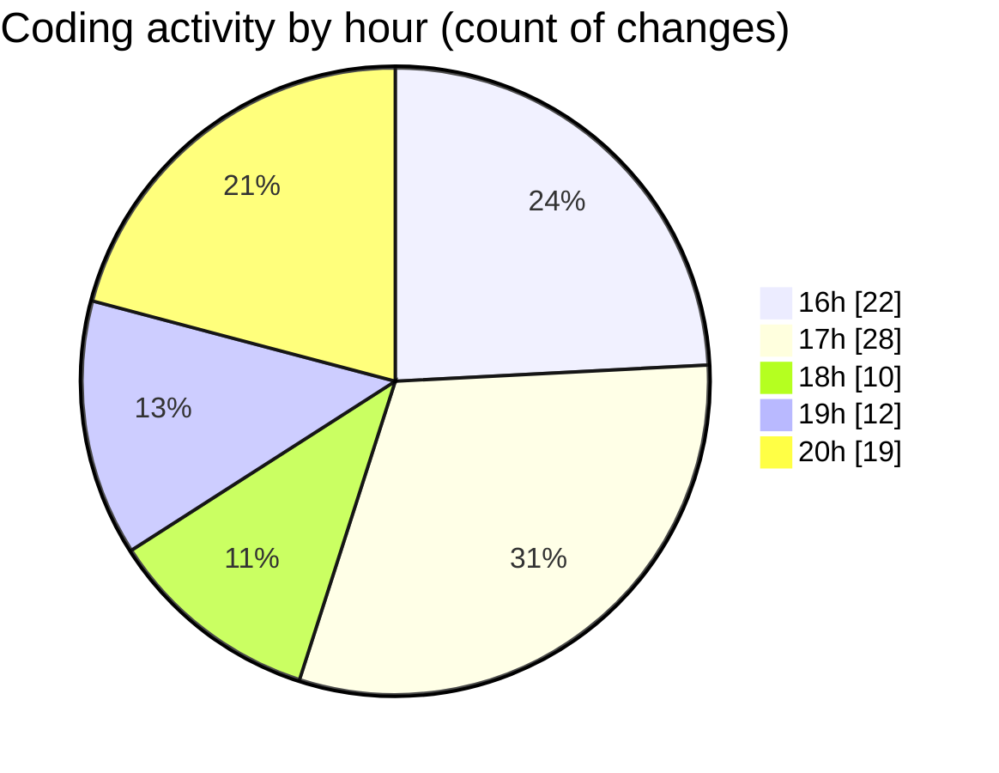

# Bot V1.2 - Activity Summary 

## Overall Statistics

| Stat                   | Value                                                             |
| ---------------------- | ----------------------------------------------------------------- |
| **Lines Added** (➕)   | 6783                                          |
| **Lines Removed** (➖) | 873                                        |
| **Net Change** (↕)    | 5910                |
| **Active Time** (⌚)   | 116 minutes |

## Modified Files
- **ConfigManager.js** (+586, -397)
- **dashboard.js** (+921, -13)
- **index.js** (+493, -0)
- **chat-flow.js** (+523, -0)
- **launcher.cs** (+217, -45)
- **build.ps1** (+58, -0)
- **BotManager.js** (+269, -0)
- **calafate_glaciares.txt** (+139, -14)
- **ushuaia_passeios.txt** (+101, -7)
- **follow-up-service.js** (+1048, -1)
- **config.html** (+391, -61)
- **newchats.html** (+312, -53)
- **followup.html** (+245, -7)
- **index.html** (+345, -0)
- **auth.js** (+150, -6)
- **whatsapp.js** (+165, -0)
- **blacklist.json** (+265, -264)
- **design-tokens.css** (+212, -0)
- **layout-base.css** (+343, -5)

## Visualizations

### By File Type (Lines Changed)

### By Hour (Estimated Activity Count)

> **Last Updated:** 17/02/2026, 20:57:48