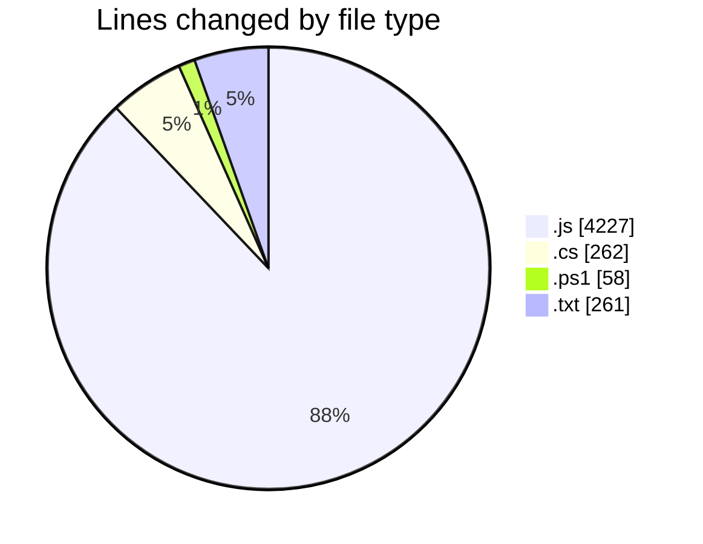
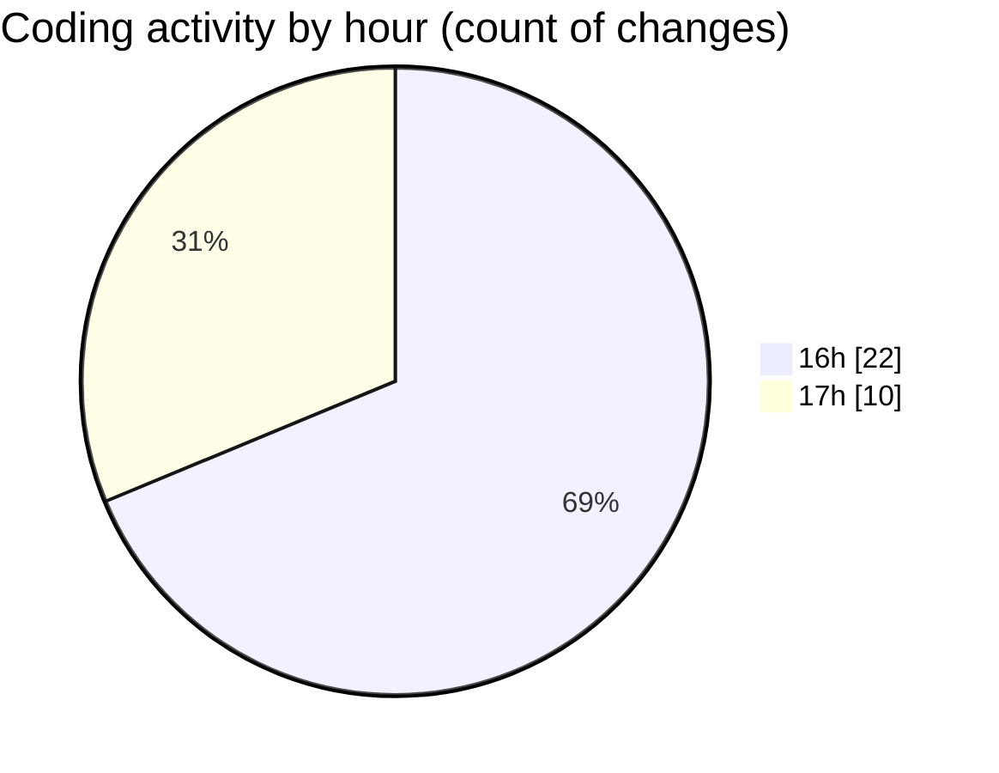

# Bot V1.2 - Activity Summary 

## Overall Statistics

| Stat                   | Value                                                             |
| ---------------------- | ----------------------------------------------------------------- |
| **Lines Added** (➕)   | 4344                                          |
| **Lines Removed** (➖) | 464                                        |
| **Net Change** (↕)    | 3880                |
| **Active Time** (⌚)   | 41 minutes |

## Modified Files
- **ConfigManager.js** (+586, -397)
- **dashboard.js** (+912, -0)
- **index.js** (+491, -0)
- **chat-flow.js** (+523, -0)
- **launcher.cs** (+217, -45)
- **build.ps1** (+58, -0)
- **BotManager.js** (+269, -0)
- **calafate_glaciares.txt** (+139, -14)
- **ushuaia_passeios.txt** (+101, -7)
- **follow-up-service.js** (+1048, -1)

## Visualizations

### By File Type (Lines Changed)

### By Hour (Estimated Activity Count)

> **Last Updated:** 17/02/2026, 17:37:48