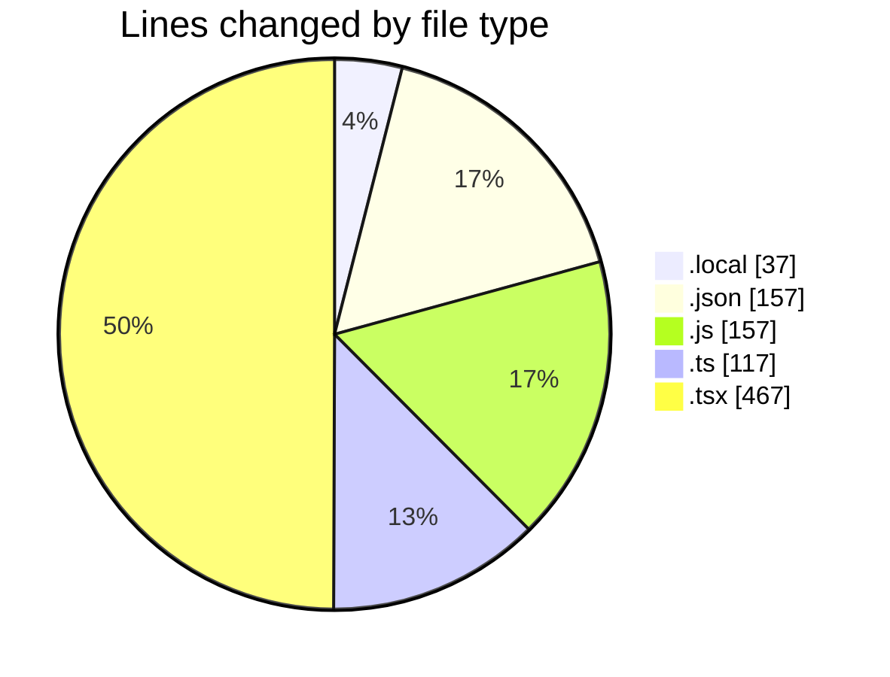
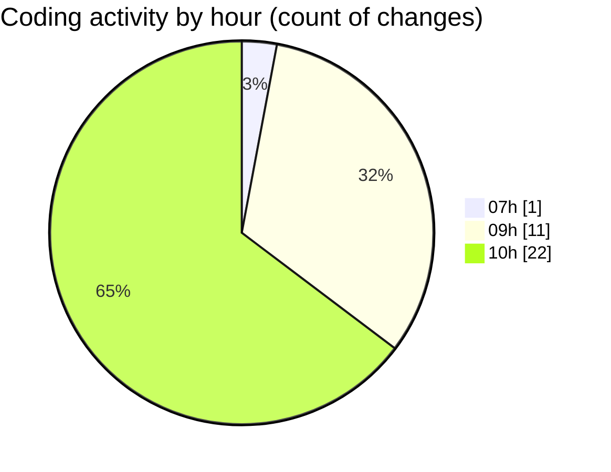

# ID.IA - Activity Summary 

## Overall Statistics

| Stat                   | Value                                                             |
| ---------------------- | ----------------------------------------------------------------- |
| **Lines Added** (➕)   | 771                                          |
| **Lines Removed** (➖) | 164                                        |
| **Net Change** (↕)    | 607                |
| **Active Time** (⌚)   | 25 minutes |

## Modified Files
- **.env.local** (+37, -0)
- **package.json** (+130, -0)
- **next.config.js** (+51, -18)
- **create-user-simple.js** (+35, -0)
- **.eslintrc.json** (+27, -0)
- **create-workspace.js** (+45, -8)
- **middleware.ts** (+82, -35)
- **page.tsx** (+133, -98)
- **layout.tsx** (+231, -5)

## Visualizations

### By File Type (Lines Changed)

### By Hour (Estimated Activity Count)

> **Last Updated:** 17/02/2026, 10:41:45