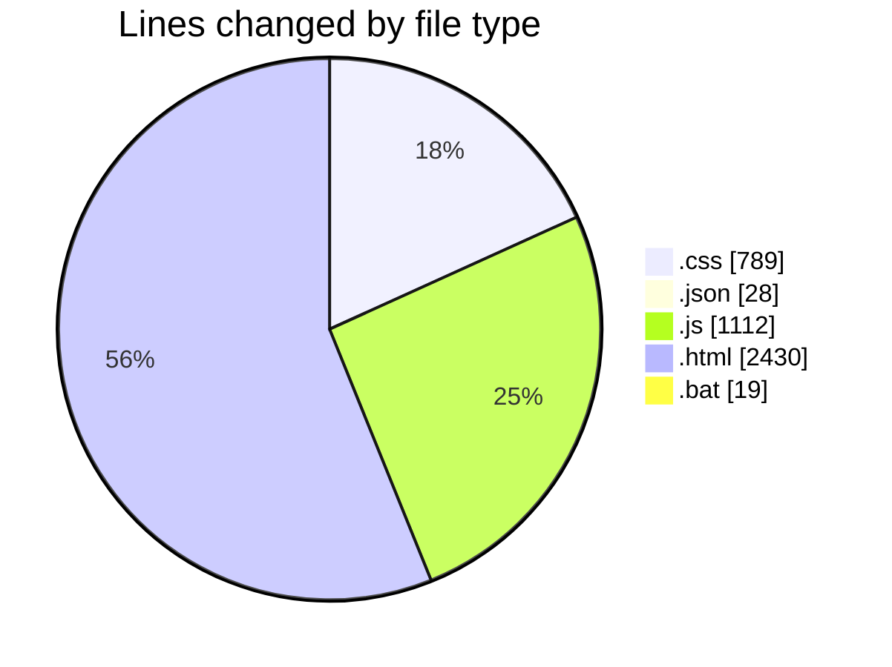
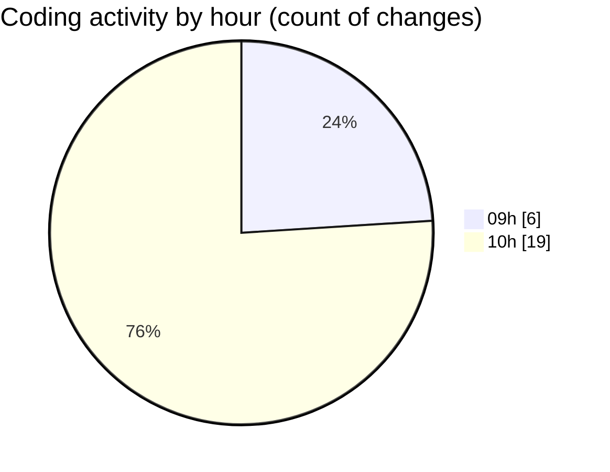

# Bot V1.2 - Activity Summary 

## Overall Statistics

| Stat                   | Value                                                             |
| ---------------------- | ----------------------------------------------------------------- |
| **Lines Added** (➕)   | 4139                                          |
| **Lines Removed** (➖) | 239                                        |
| **Net Change** (↕)    | 3900                |
| **Active Time** (⌚)   | 35 minutes |

## Modified Files
- **dashboard.css** (+773, -16)
- **settings.json** (+28, -0)
- **toast-manager.js** (+80, -0)
- **index.html** (+689, -87)
- **config.html** (+607, -1)
- **followup.html** (+475, -1)
- **newchats.html** (+569, -1)
- **LIMPEZA_CACHE.bat** (+16, -3)
- **dashboard.js** (+902, -130)

## Visualizations

### By File Type (Lines Changed)

### By Hour (Estimated Activity Count)

> **Last Updated:** 18/02/2026, 10:18:08