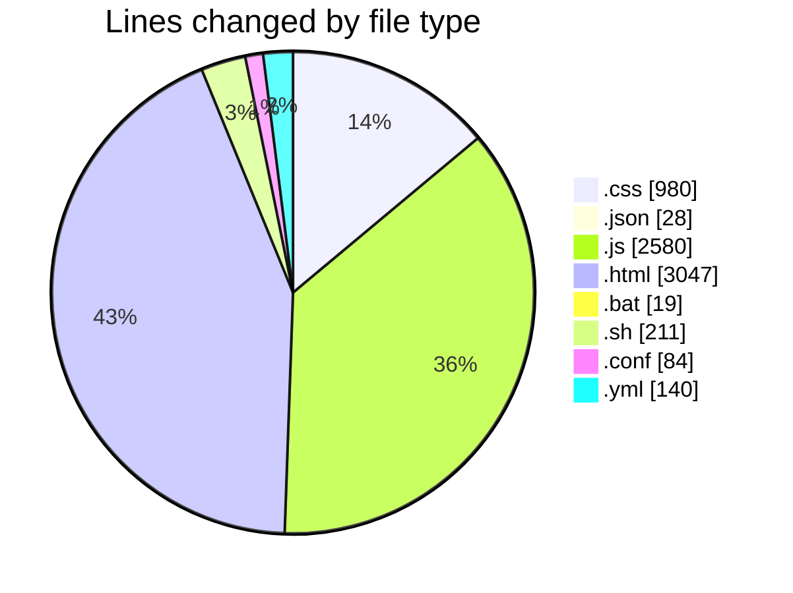
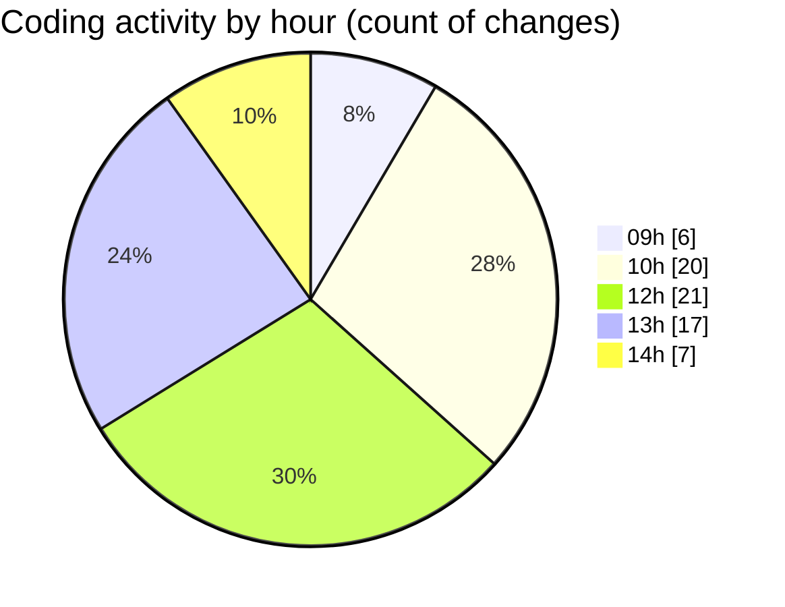

# Bot V1.2 - Activity Summary 

## Overall Statistics

| Stat                   | Value                                                             |
| ---------------------- | ----------------------------------------------------------------- |
| **Lines Added** (➕)   | 6313                                          |
| **Lines Removed** (➖) | 776                                        |
| **Net Change** (↕)    | 5537                |
| **Active Time** (⌚)   | 82 minutes |

## Modified Files
- **dashboard.css** (+773, -16)
- **settings.json** (+28, -0)
- **toast-manager.js** (+80, -0)
- **index.html** (+689, -199)
- **config.html** (+607, -191)
- **followup.html** (+475, -90)
- **newchats.html** (+569, -95)
- **LIMPEZA_CACHE.bat** (+16, -3)
- **dashboard.js** (+1009, -147)
- **whatsapp.js** (+165, -0)
- **index.js** (+490, -0)
- **BotLoop.js** (+191, -0)
- **deploy.sh** (+81, -0)
- **monitor.sh** (+68, -0)
- **rollback.sh** (+62, -0)
- **nginx.conf** (+84, -0)
- **deploy.yml** (+140, -0)
- **chat.js** (+165, -0)
- **Tkn-effects.css** (+156, -35)
- **test-components.html** (+132, -0)
- **layout-loader.js** (+333, -0)

## Visualizations

### By File Type (Lines Changed)

### By Hour (Estimated Activity Count)

> **Last Updated:** 18/02/2026, 14:03:10