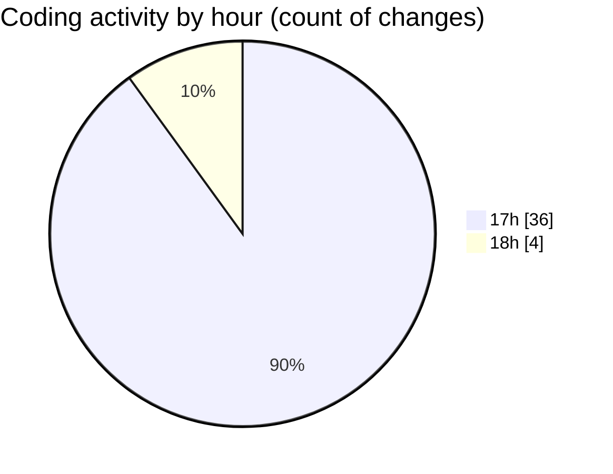

# BOT I.A - Activity Summary 

## Overall Statistics

| Stat                   | Value                                                             |
| ---------------------- | ----------------------------------------------------------------- |
| **Lines Added** (➕)   | 4528                                          |
| **Lines Removed** (➖) | 3614                                        |
| **Net Change** (↕)    | 914                |
| **Active Time** (⌚)   | 41 minutes |

## Modified Files
- **Arquitetura Profissional.txt** (+28, -3)
- **index.js** (+303, -240)
- **server.js** (+485, -438)
- **monitor-service.js** (+307, -306)
- **follow-up-service.js** (+572, -296)
- **chat.js** (+247, -246)
- **auth.js** (+180, -179)
- **aiService.js** (+319, -318)
- **BotManager.js** (+349, -348)
- **BotLoop.js** (+280, -220)
- **chat-flow.js** (+827, -509)
- **logger.js** (+68, -67)
- **EventBus.js** (+168, -167)
- **ConfigManager.js** (+146, -145)
- **BrowserManager.js** (+193, -132)
- **BlacklistManager.js** (+56, -0)

## Visualizations

### By File Type (Lines Changed)

### By Hour (Estimated Activity Count)

> **Last Updated:** 19/02/2026, 18:08:29