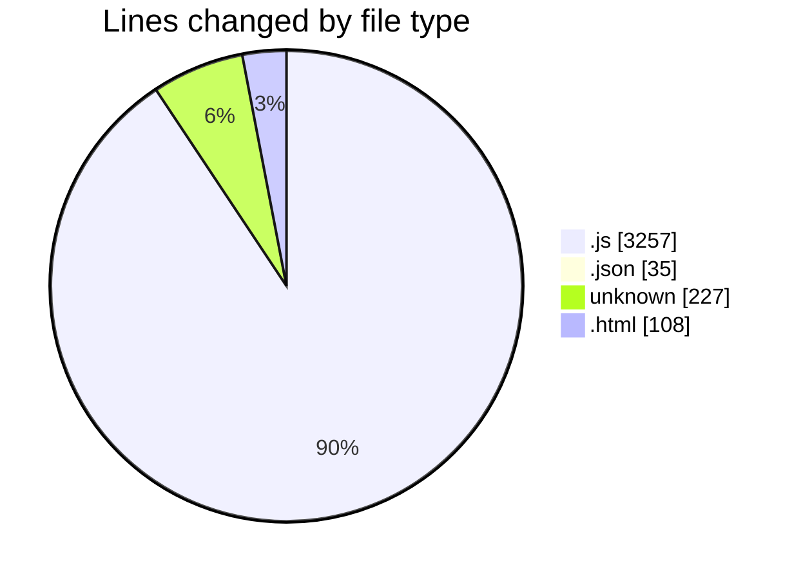
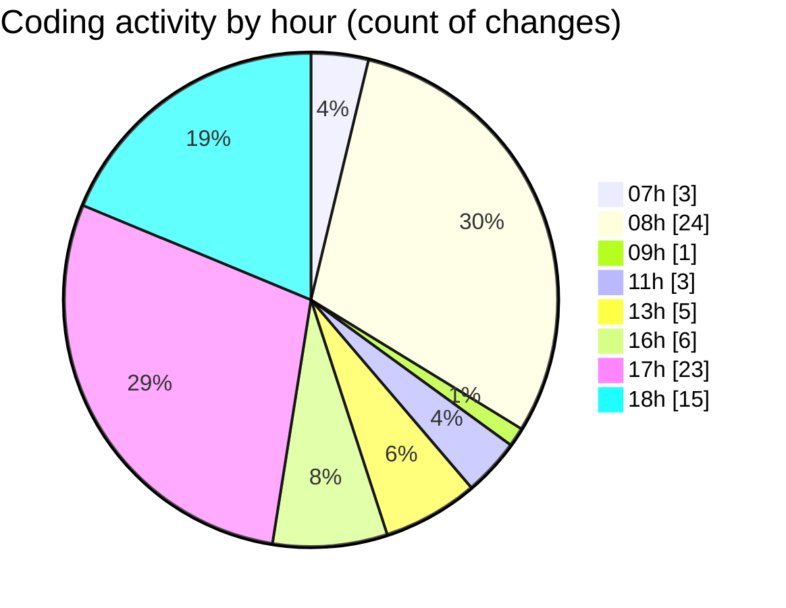

# BOT I.A - Activity Summary 

## Overall Statistics

| Stat                   | Value                                                             |
| ---------------------- | ----------------------------------------------------------------- |
| **Lines Added** (➕)   | 3115                                          |
| **Lines Removed** (➖) | 512                                        |
| **Net Change** (↕)    | 2603                |
| **Active Time** (⌚)   | 103 minutes |

## Modified Files
- **logger.js** (+283, -118)
- **settings.js** (+39, -0)
- **config-api.js** (+91, -0)
- **APIRouter.js** (+101, -10)
- **auth.js** (+191, -46)
- **chat.js** (+97, -8)
- **monitor-service.js** (+95, -3)
- **health-service.js** (+102, -0)
- **aiService.js** (+234, -125)
- **ConfigManager.js** (+106, -2)
- **EventBus.js** (+30, -0)
- **BotManager.js** (+271, -89)
- **package.json** (+35, -0)
- **.gitignore** (+26, -0)
- **index.html** (+14, -0)
- **sidebar.html** (+88, -0)
- **footer.html** (+6, -0)
- **vite.config.js** (+23, -1)
- **.env** (+122, -79)
- **settings.js** (+100, -9)
- **BotLoop.js** (+139, -4)
- **index.js** (+14, -14)
- **follow-up-service.js** (+771, -0)
- **config-api.js** (+137, -0)
- **chat-flow.js** (+0, -4)

## Visualizations

### By File Type (Lines Changed)

### By Hour (Estimated Activity Count)

> **Last Updated:** 20/02/2026, 18:58:32