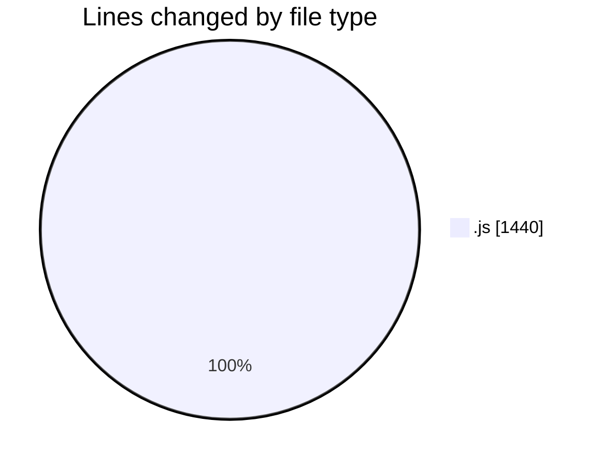
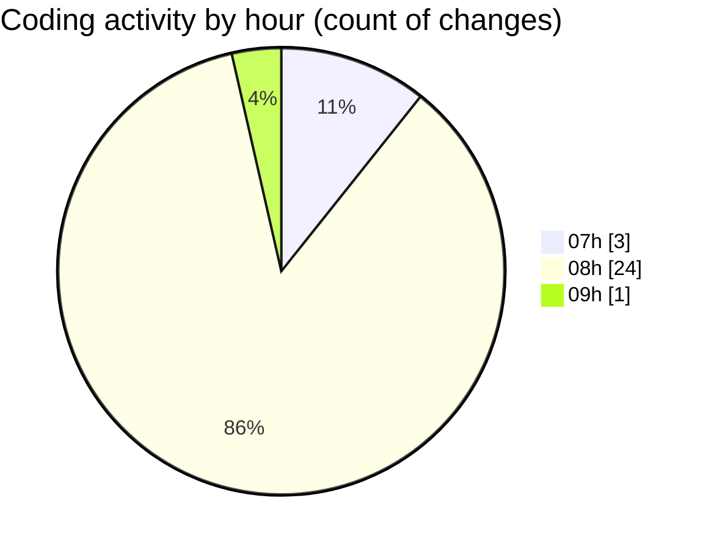

# BOT I.A - Activity Summary 

## Overall Statistics

| Stat                   | Value                                                             |
| ---------------------- | ----------------------------------------------------------------- |
| **Lines Added** (➕)   | 1289                                          |
| **Lines Removed** (➖) | 151                                        |
| **Net Change** (↕)    | 1138                |
| **Active Time** (⌚)   | 32 minutes |

## Modified Files
- **logger.js** (+228, -118)
- **settings.js** (+39, -0)
- **config-api.js** (+91, -0)
- **APIRouter.js** (+101, -10)
- **auth.js** (+111, -6)
- **chat.js** (+97, -8)
- **monitor-service.js** (+95, -3)
- **health-service.js** (+102, -0)
- **aiService.js** (+115, -6)
- **ConfigManager.js** (+100, -0)
- **EventBus.js** (+30, -0)
- **BotManager.js** (+180, -0)

## Visualizations

### By File Type (Lines Changed)

### By Hour (Estimated Activity Count)

> **Last Updated:** 20/02/2026, 09:13:31