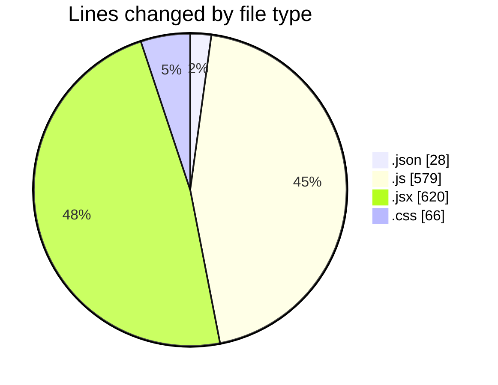
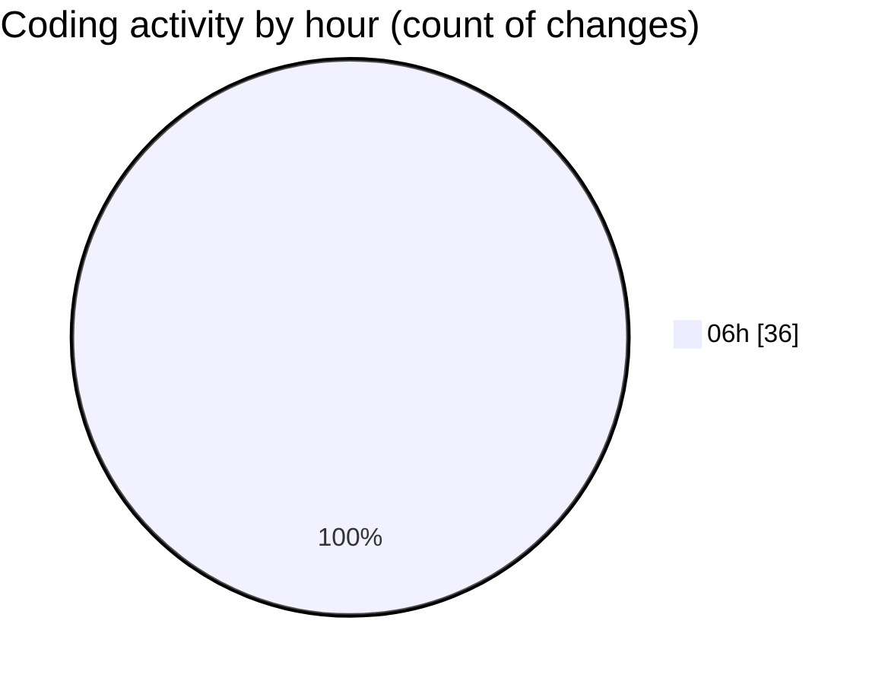

# BOT I.A - Activity Summary 

## Overall Statistics

| Stat                   | Value                                                             |
| ---------------------- | ----------------------------------------------------------------- |
| **Lines Added** (➕)   | 1250                                          |
| **Lines Removed** (➖) | 43                                        |
| **Net Change** (↕)    | 1207                |
| **Active Time** (⌚)   | 39 minutes |

## Modified Files
- **saved_settings.json** (+25, -3)
- **aiService.js** (+30, -0)
- **APIRouter.js** (+333, -0)
- **api.js** (+112, -0)
- **BotControls.jsx** (+272, -0)
- **useSocket.js** (+98, -2)
- **settings.js** (+0, -4)
- **Dashboard.jsx** (+140, -0)
- **StatCard.jsx** (+32, -0)
- **LogsViewer.jsx** (+118, -0)
- **App.jsx** (+36, -22)
- **App.css** (+54, -12)

## Visualizations

### By File Type (Lines Changed)

### By Hour (Estimated Activity Count)

> **Last Updated:** 21/02/2026, 06:53:33